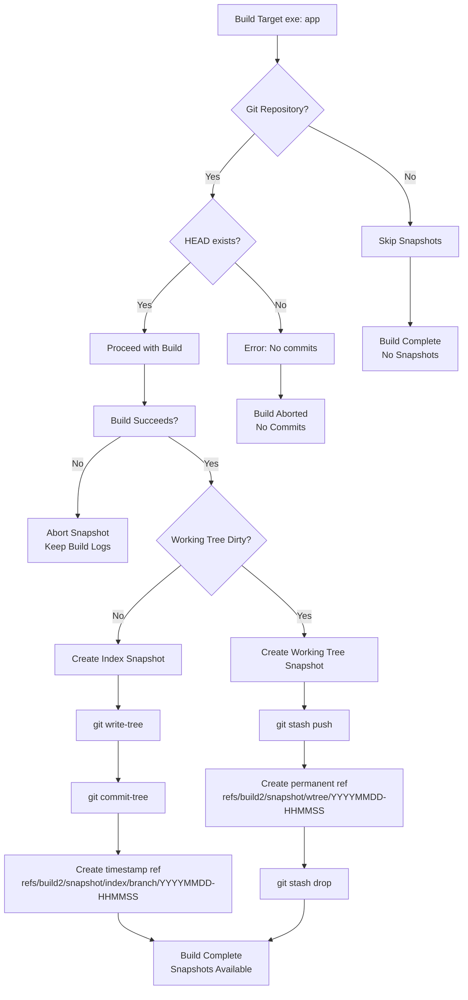

# libbuild2-snapshot

The `libbuild2-snapshot` build2 module automatically creates Git snapshots of your project state during the build process. It captures both the current index state and working tree changes, storing them as permanent Git references.


## Why is it?

You're working on a new feature. Halfway through, the build starts failing.
You've made several changes, some staged, some still in your working directory,
and you haven't committed anything yet. You try to backtrack but can't recall
exactly what state things were in when it last worked.

Because `libbuild2-snapshot` is enabled, a snapshot was automatically recorded
during the last successful build. It captures both the index and the working
directory as they were at that moment. You check out the snapshot, rebuild, and
confirm the issue wasn't present. From there, it's straightforward to diff,
test, and narrow down what changed.

Even outside of debugging, snapshots are useful while developing. You can move
quickly, make changes freely, and rely on each build to preserve the context.
There's no need to interrupt your workflow with temporary commits just to save a
known-good state.

When refactoring or updating dependencies, having a snapshot gives you a way to
roll back without having to reset or undo anything manually. You simply return
to the build as it was.

And because every snapshot records exactly what was built, including uncommitted
edits, you can go back and see not just what changed, but what effect it had,
without guessing or reconstructing after the fact.

## What is it?

That kind of recovery is possible because `libbuild2-snapshot` ties directly
into the build2 build system. It monitors your builds and automatically records
a snapshot of the Git repository state whenever an executable target is updated.

Each snapshot captures exactly what was in your index and working directory at
build time, and stores it as a Git reference under `refs/build2/snapshot/`. This
includes both committed and uncommitted changes, so you always have an exact
record of what was built.

Here's what that looks like in a typical repository:

```
.
├── buildfile
├── LICENSE.md
├── manifest
├── README.md
├── repositories.manifest
├── build
│   ├── bootstrap.build
│   └── root.build
├── hello
│   ├── buildfile
│   ├── testscript
│   └── hello.cxx
└── .git
    └── refs/build2/snapshot
        ├── index
        │   ├── main/20250528-143022        # Index snapshot on main branch
        │   └── feature/20250528-143155     # Index snapshot on feature branch
        └── wtree
            ├── 20250528-143022             # Working tree snapshot
            └── 20250528-143155             # Another working tree snapshot
```

## How it works



## Installation

> [!NOTE]
> This module is currently under development and not yet released to the public repository. You'll need to build it locally first.

### Development Build

Clone and build the module locally:

```bash
git clone .../libbuild2-snapshot.git
cd libbuild2-snapshot

bdep init --empty

bdep config create @module ../libbuild2-snapshot-build/module/ --type build2 cc config.config.load=~build2
bdep config create @target ../libbuild2-snapshot-build/target/ cc config.cxx=g++

bdep init @module -d libbuild2-snapshot/
bdep init @target -d libbuild2-snapshot-tests/

bdep update
```

Configure build2 to find the locally built module by creating `~/.build2/b.options`:

```bash
echo '!config.import.libbuild2_snapshot=.../libbuild2-snapshot-build/module/' >> ~/.build2/b.options
```

*Adjust the path to match your actual build location.*

### Future Release

When the module is published, you'll be able to add it to your project's `manifest`:

```yaml
depends: libbuild2-snapshot ^0.1.0
```

## Quick Start

Add the module to your `buildfile`:

```buildfile
using snapshot

exe{hello}: {hxx cxx}{**}
```

That's it! Snapshots will be created automatically when `exe{hello}` is built.


## Snapshots

### Listing Snapshots

List all snapshots:
```bash
git for-each-ref refs/build2/snapshot/
```

### Viewing Snapshot Content

View a specific snapshot:
```bash
git show refs/build2/snapshot/index/main/20250528-143022
```

### Restoring from Snapshots

Checkout a snapshot (creates a detached HEAD):
```bash
git checkout refs/build2/snapshot/wtree/20250528-143022
```

### Comparing Snapshots

Compare current state with a snapshot:
```bash
git diff refs/build2/snapshot/index/main/20250528-143022
```

<!-- draft

## Configuration

The module provides several configuration options through the `snapshot_config` structure:

| Option | Default | Description |
|--------|---------|-------------|
| `include_working_tree` | `true` | Create snapshots of uncommitted changes |
| `include_untracked` | `true` | Include untracked files in working tree snapshots |
| `ref_prefix` | `"refs/build2/snapshot"` | Base path for snapshot references |
| `message` | Auto-generated | Custom commit message for snapshots |

-->

<!-- draft: explore?

## Advanced Usage

### Custom Snapshot Messages

You can customize snapshot messages programmatically:

```cpp
#include <libbuild2/snapshot/git.hxx>

build2::snapshot::git_repository repo;
repo.snapshot("Custom build snapshot: feature XYZ");
```

### Manual Snapshots

Create snapshots outside the build system:

```cpp
#include <libbuild2/snapshot/git.hxx>

using namespace build2::snapshot;

git_repository repo;
git_snapshot_manager::snapshot_config config;
config.message = "Manual snapshot";
config.include_untracked = false;

auto& manager = repo.snapshot_manager();
manager.create_snapshot(config);
```

### Repository State Queries

Check repository state before building:

```cpp
#include <libbuild2/snapshot/git.hxx>

build2::snapshot::git_repository repo;

if (!repo.is_clean()) {
    auto branch = repo.current_branch();
    // Handle dirty state...
}
```

-->

## Troubleshooting

### Common Issues

**Module not found**:
- Ensure `libbuild2-snapshot` is properly installed and in the module path
- Check build2 version compatibility (requires build2 >= 0.17.0)

**Permission errors**:
- Verify write access to the Git repository
- Check file system permissions on `.git/refs/`

**Large repository performance**:
- Consider using `.gitignore` to exclude large binary files
- Use Git LFS for large assets

### Error Messages

- `"not a git repository"`: Ensure you're in a Git repository
- `"no HEAD commit found"`: Repository needs at least one commit
- `"command failed"`: Check Git installation and repository integrity
- `"git command failed"`: Verify Git is in PATH and repository is accessible

### Debug mode

Enable verbose logging by setting the build2 verbosity level:
```bash
b --verbose 5  # Maximum verbosity for detailed snapshot operations
```

## Performance considerations

### Storage overhead

- Each snapshot creates additional Git objects (commits, trees)
- Index snapshots are lightweight (reference existing objects)
- Working tree snapshots can be larger (store uncommitted changes)
- Consider regular cleanup for long-running projects

### Build performance

- Snapshot creation adds ~50-200ms per build (depending on repository size)
- Working tree snapshots may take longer with many untracked files
- Use `.gitignore` to exclude large binary files and build artifacts

<!-- draft: see also advanced usage

## API Reference

The module provides a C++ API for Git repository operations:

### Core Classes

- **`git_repository`**: Main interface for repository operations
- **`git_snapshot_manager`**: Handles snapshot creation and management
- **`git_repository_state`**: Queries repository state and status
- **`git_reference_manager`**: Manages Git references and namespaces
- **`git_command_executor`**: Low-level Git command execution

### Key Methods

```cpp
// Create a snapshot with custom message
repo.snapshot("Build snapshot");

// Check if working tree is clean
bool clean = repo.is_clean();

// Get current branch name
auto branch = repo.current_branch();

// Access low-level subsystems
auto& state = repo.state();
auto& refs = repo.references();
```

-->

## License

This module is distributed under the MIT license.
